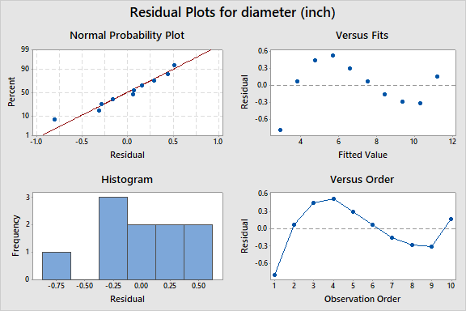

```{r setup, include=FALSE}
knitr::opts_chunk$set(echo = TRUE)
library(ggplot2)
```

<style>
  .2-col {
    columns: 2 200px;
    -webkit-columns: 2 200px;
    -moz-columns: 2 200px;
  }
</style>

####3)
```{r echo=FALSE}

```
a) The association between weight and fuel efficiency seems to be relatively strong and linear. It is in the negative direction. There is some potential for a non-linear (curved) relationship, however.
b) The slope of the line predicts that for every 1000-pound increase in weight, the fuel efficiency decreases by approximately 7.65.
c) A linear model may not be appropriate for this data as the residuals seem to be somewhat curved/quadratic, in a U-shape.

####5)
a) This model appears to be better, with both a higher R-squared along with more random residuals.
b) `[gal/100 mi] = 0.625 + 1.178 [weight]`
c) The slope of the line predicts that for every 1000-pound increase in weight, approximately 1.178 more gallons of fuel will be needed to drive 100 miles.
d) 21.06 miles/gallon.

####24)
a)
```{r weight_fit, echo=FALSE, message=FALSE}

```
`[weight lifted] = 2.401 * [weight class] + 179.9`
b)
```{r weight_reg, echo=FALSE, message=FALSE}

```
<br/> The residuals appear to have an obvious curve; thus the linear model is not appropriate.
c) `[weight lifted]^2 = -461800 + 137992 * log([weight class])`
d) The residuals had less of an obvious shape, making my model better compared to the linear model.
```{r weight_sq_reg, echo=FALSE, message=FALSE}

```
e) Boevski had the most surprising performance as he deviated most strongly from the line of fit (seen in his residual).

####32)
a)
```{r diameter_reg, echo=FALSE, message=FALSE}

```
<br/> There is a very clear curve to the model that almost appears cubic. Thus I do not feel that a linear model is correct.
b) The fit would be about the same (or rather simply does not matter) as either way a linear fit would not apply such a dataset (that looks almost cubic).